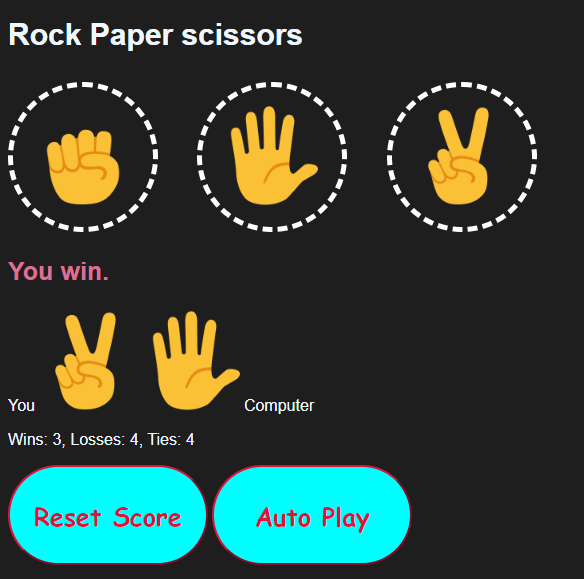

# Rock Paper Scissors Game

This is a simple Rock Paper Scissors game implemented using HTML, CSS, and JavaScript. You can play against the computer and keep track of your wins, losses, and ties.

## Features

- Play Rock Paper Scissors against the computer.
- Keep track of game statistics including wins, losses, and ties.
- Reset the score to start a new game.
- Auto-play mode to let the computer play against itself.
- Keyboard shortcuts for fast gameplay
## How to Play

1. Clone this repository to your local machine.
2. Open the `index.html` file in your web browser.
3. Click on one of the buttons to make your move (Rock, Paper, or Scissors).
4. Alternatively, you can use the keyboard shortcuts:
   - Press 'r' for Rock.
   - Press 'p' for Paper.
   - Press 's' for Scissors.
5. The computer will randomly select its move.
6. The result of the game will be displayed along with updated scores.
7.add 7(load the page with link)
## Auto-play Mode

You can enable auto-play mode by clicking the "Auto Play" button. In auto-play mode, the computer will play against itself automatically, with one move every second. Click the "Auto Play" button again to stop auto-play mode.

## Resetting the Score

To reset the score and start a new game, click the "Reset Score" button. This will set all scores (wins, losses, and ties) back to zero.

## Technologies Used

- HTML5
- CSS3
- JavaScript

## Preview

## Credits
- Coding guide by [Simon](https://supersimple.dev/).
- Images sourced from [Simon](https://supersimple.dev/).
